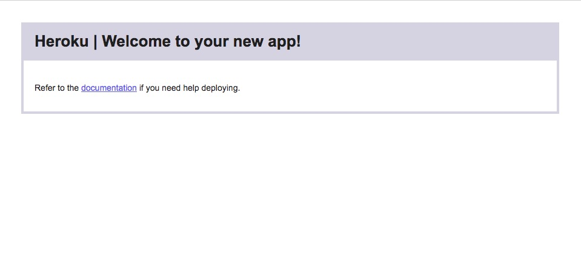
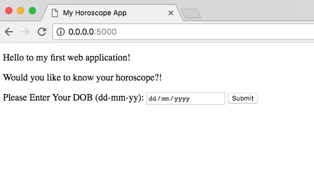

# py-horoscope-app

A simple demo flask app, deployable to Heroku.

## Prerequisites

You should have the following installed on your machine:
- Python 2.7.X
- pip
- git

## Setup

Follow these steps to get this app running in Heroku:
- Create a Heroku account [here](https://signup.heroku.com/)
- Download and install the Heroku CLI from [here](https://devcenter.heroku.com/articles/getting-started-with-python#set-up)
- Clone this repository: `git clone git@github.com:mithra1/py-horoscope-app.git`
- Create a new Heroku app for python via the CLI `heroku create --buildpack heroku/python`

This will give you output similar to:

```bash
heroku create --buildpack heroku/python

Creating app... done, ⬢ secret-ocean-14642
Setting buildpack to heroku/python... done
https://gory-crypt-96819.herokuapp.com/ | https://git.heroku.com/gory-crypt-96819.git
```

You now have a basic app running on https://gory-crypt-96819.herokuapp.com/



We can now deploy the py-horoscope-app to Heroku:
- To deploy, we can run the command `git push heroku master`

This will give you output similar to:

```bash
git push heroku master

Counting objects: 15, done.
Delta compression using up to 4 threads.
Compressing objects: 100% (12/12), done.
Writing objects: 100% (15/15), 1.58 KiB | 810.00 KiB/s, done.
Total 15 (delta 6), reused 0 (delta 0)
remote: Compressing source files... done.
remote: Building source:
remote:
remote: -----> Python app detected
remote: -----> Installing requirements with pip
remote:
remote: -----> Discovering process types
remote:        Procfile declares types -> web
remote:
remote: -----> Compressing...
remote:        Done: 31.3M
remote: -----> Launching...
remote:        Released v8
remote:        https://gory-crypt-96819.herokuapp.com/ deployed to Heroku
remote:
remote: Verifying deploy... done.
To https://git.heroku.com/gory-crypt-96819.git
 + 9aa9f20...4b588bd master -> master
```

Your app will now be deployed and available on https://gory-crypt-96819.herokuapp.com/


## Developing

To run this app locally, we first need to isntall the apps requirements

```bash
pip install -r requirements.txt
```

Now we have requirements installed, we can run a local Heroku server:

```bash
heroku local
```

This will give you output similar to:

```bash
heroku local

[WARN] No ENV file found
10:46:18 web.1   |  [2017-11-01 10:46:18 +0000] [61940] [INFO] Starting gunicorn 19.7.1
10:46:18 web.1   |  [2017-11-01 10:46:18 +0000] [61940] [INFO] Listening at: http://0.0.0.0:5000 (61940)
10:46:18 web.1   |  [2017-11-01 10:46:18 +0000] [61940] [INFO] Using worker: sync
10:46:18 web.1   |  [2017-11-01 10:46:18 +0000] [61943] [INFO] Booting worker with pid: 61943
```

We can see from line 2 that we have an app running on http://0.0.0.0:5000. If we open this address in the browser, we can see our app:



We can now open our editor (Atom, Sublime, VSCode etc) and edit the app and refresh the browser to see the changes.